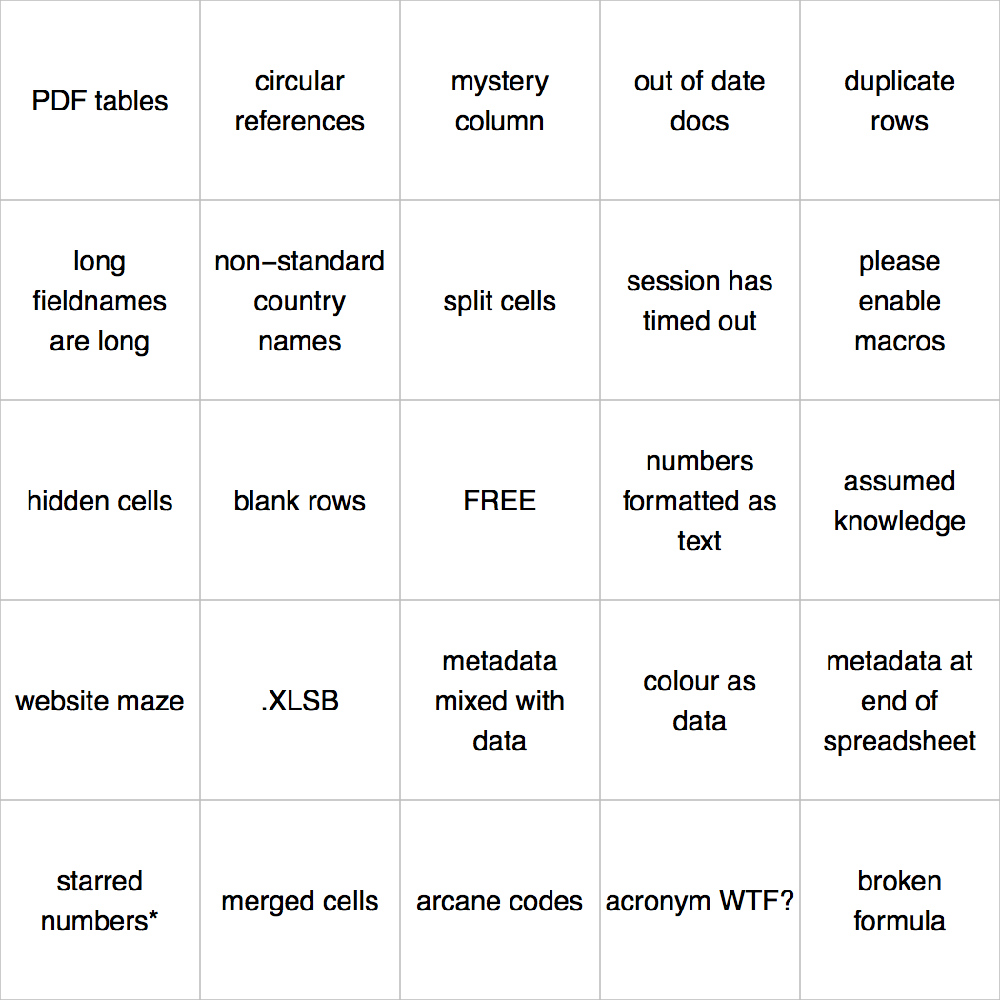

<!-- README.md is generated from README.Rmd. Please edit that file -->

<!-- badges: start -->

[](https://travis-ci.org/jennybc/bingo)
[](https://ci.appveyor.com/project/jennybc/bingo)
[](https://codecov.io/gh/jennybc/bingo?branch=master)
<!-- badges: end -->

# bingo

Generate Bingo cards.

Currently has built-in squares for SuperBowl 50 :football: and data /
spreadsheet craziness :chart\_with\_downwards\_trend: and more. Or you
can provide your own text for the squares.

Make printable Bingo cards **without installing anything** via this
Shiny app:

  - <http://daattali.com/shiny/bingo/>
  - It’s also included in the package (see
    [below](#run-shiny-app-locally)).

Feel free to help us make these cards less ugly or to explore new bingo
topics\! PRs welcome :grin:.

## Installation

Install from GitHub with:

``` r
# install.packages("devtools")
devtools::install_github("jennybc/bingo")
```

## SuperBowl Example

``` r
library(bingo)

## see some of the SuperBowl 50 squares
tail(get_topic("football"))
#> [1] "Shot of Golden Gate Bridge"                
#> [2] "\"Silicon Valley and tech\" blah blah blah"
#> [3] "Mike Carey is WRONG"                       
#> [4] "Unexpected artist joins Beyoncé"           
#> [5] "Cam's Superman shirt-opening thing"        
#> [6] "Idle speculation it's Peyton's last game"

## make 8 bingo cards
bc <- bingo(n_cards = 8, words = get_topic("football"))

## print them to PDF
plot(bc)
#> Writing to file ...
#>   ./bingo-01.pdf
#>   ./bingo-02.pdf
#>   ./bingo-03.pdf
#>   ./bingo-04.pdf
#>   ./bingo-05.pdf
#>   ./bingo-06.pdf
#>   ./bingo-07.pdf
#>   ./bingo-08.pdf
```

Here’s what one looks like:


## “Open” and Bad Data Examples

We offer two sets of squares inspired by the ~~pain~~ joy of dealing
with
[`#otherpeoplesdata`](https://twitter.com/search?q=%23otherpeoplesdata&src=tyah)

Use `get_topic("open-data")` to get squares based on this tweet from
Chris McDowall:

> For two weeks I noted issues encountered as I used NZ govt data. Today
> I collected enough to make a bingo card. *[@fogonwater,
> January 3, 2016](https://twitter.com/fogonwater/status/683785398112260097)*

Use `get_topic("bad-data")` to get squares inspired by the [Quartz guide
to bad data](https://github.com/Quartz/bad-data-guide):

> An exhaustive reference to problems seen in real-world data along with
> suggestions on how to resolve them…. Most of these problems can be
> solved. Some of them can’t be solved and that means you should not use
> the data. Others can’t be solved, but with precautions you can
> continue using the data.

``` r
## see some Open Data squares
tail(get_topic("open-data"))
#> [1] "PDF tables"                       "numbers formatted as text"       
#> [3] "metadata expressed as fieldnames" "fieldname EDA"                   
#> [5] "regex-driven workflow"            "named region non-sequiturs"

## see some Bad Data squares
tail(get_topic("bad-data"))
#> [1] "Data disguised as formatting"                  
#> [2] "Ambiguous American date formats, eg 03/04/16"  
#> [3] "\"Virgin Birth\", ie no provenance"            
#> [4] "Location of 0°N 0°E, ie \"Null Island\""       
#> [5] "Spelling mistakes that reek of hand-typed data"
#> [6] "US zip codes 12345 or 90210"

## make a single Open Data bingo card
## Note that "open-data" is the default topic, so you could alternatively use: bc <- bingo().
bc <- bingo(words = get_topic("open-data"))

## make a custom bingo blend from the open and bad data squares
bc <- bingo(words = c(get_topic("open-data"), get_topic("bad-data")))

## print it
plot(bc, pdf_base = "open-data-")
#> Writing to file ...
#>   ./open-data-01.pdf
```

Here’s an Open Data bingo card:



## Run Shiny app locally

To run [the app we’re running
remotely](http://daattali.com/shiny/bingo/) on your own machine, do
this:

``` r
launch()
```
