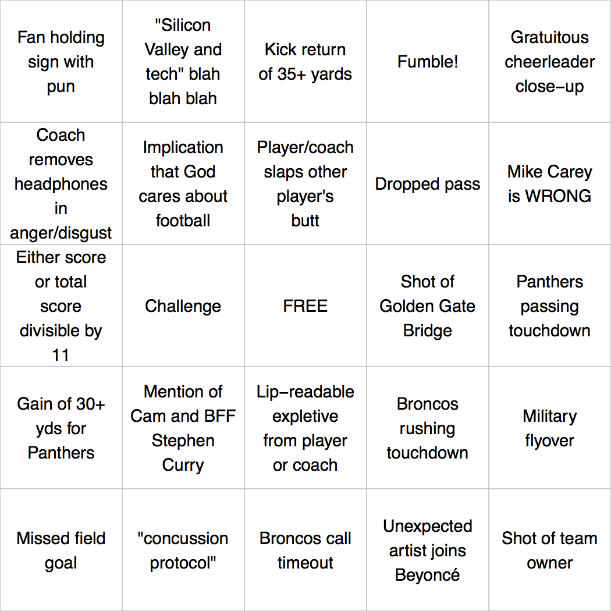

<!-- README.md is generated from README.Rmd. Please edit that file -->
bingo
=====

Generate Bingo cards.

Currently has built-in squares for SuperBowl 50 :football: and open data / spreadsheet craziness :chart\_with\_downwards\_trend:.

Installation
------------

Install from github with:

``` r
# install.packages("devtools")
devtools::install_github("jennybc/bingo")
```

SuperBowl Example
-----------------

``` r
library(bingo)

## see some of the SuperBowl 50 squares
tail(superbowl_50_2016())
#> [1] "Shot of Golden Gate Bridge"                
#> [2] "\"Silicon Valley and tech\" blah blah blah"
#> [3] "Mike Carey is WRONG"                       
#> [4] "Unexpected artist joins Beyoncé"           
#> [5] "Cam's Superman shirt-opening thing"        
#> [6] "Idle speculation it's Peyton's last game"

## make 8 bingo cards (SuperBowl 50 is current default)
bc <- bingo(8)

## print them to PDF
plot(bc)
#> Writing to file ...
#>   bingo-01.pdf
#>   bingo-02.pdf
#>   bingo-03.pdf
#>   bingo-04.pdf
#>   bingo-05.pdf
#>   bingo-06.pdf
#>   bingo-07.pdf
#>   bingo-08.pdf
```

Here's what one would look like:



Open Data Example
-----------------

Attribute to <https://twitter.com/fogonwater/status/683785398112260097>

``` r
## see some of the Open Data squares
tail(open_data())
#> [1] "circular references"            "split cells"                   
#> [3] "long fieldnames are long"       "metadata at end of spreadsheet"
#> [5] "arcane codes"                   "colour as data"

## make a single Open Data bingo card
bc <- bingo(bs = open_data())

## print it
plot(bc)
#> Writing to file ...
#>   bingo-01.pdf
```

<!-- -->
